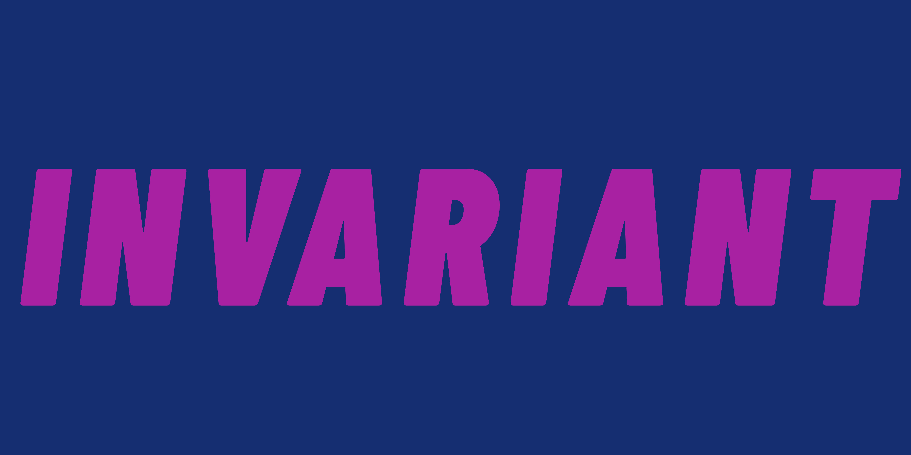

# Invariant

**Un jeu de Flemme Interactive**
## Présentation

Bienvenu sur le projet du plus grand jeu de tous les temps. On parle bien évidemment du jeu : **INVARIANT**.

Sur ce *readme*, vous trouverez toutes les informations disponibles sur le jeu. 

## Sommaire :

* [Liens utiles](#liens-utiles)

* [Présentation détaillée du projet](#présentation-détaillée-du-projet)

* [Arborescence](#arborescence)

* [Installation](#installation)
 

## Liens utiles

Notre serveur discord pour être à jour sur le jeu :

[*Le serveur Discord*](https://discord.gg/6NFS93vJ)

Lien du Youtube du studio de jeu :

*lien de la chaine youtube*

## Présentation détaillée du projet

### L'équipe :

Tout d'abord, qui sommes nous ?

* Rocma :
    * Étudiant en informatique 

* Joann :
    * ..

* Dorian :
    * Neuiiiiiiil

* Flavio :
    * Gros Neuilllllllllll

* Nolhan :
    * Je suis en première année d'études supérieur en informatique, j'aime bien le dev et j'ai envie d'en apprendre plus !

### Pourquoi ce projet ?

Nous sommes tous des étudiant en informatique, de ce fait, taper du code est notre quotidien. Mais on avait envie de faire un projet qui nous réuni, et surtout qui nous amuse! C'est pourquoi on à choisi de développer un projet commun. Mais quel projet pouvons nous faire ??? En tant qu'étudiants en informatique, on se devait de développer quelque chose en rapport avec notre super IUT, mais surtout, en rapport avec nos professeurs préférés. Alors, on a tout de suite eu l'idée de créer un petit jeu en 2D, se déroulant dans l'IUT ... (Bon, un peu revisité on l'admet).

### Comment a-t-il été réalisé ?

Tout d'abord, il est important de précisé que aucune personne de **Flemme Interactive** n'a déjà travailler sur un jeu vidéo. Il s'agit pour nous de quelque chose de nouveau. Malgré tout, nous avons tous de solides bases de développement. Nous avons choisi d'utiliser ***GODOT*** pour concevoir ce jeu. En effet, cela nous permet d'utiliser un petit moteur de jeu, gratuit, et surtout open source, et qui surtout nous laisse travailler avec différents langages. De notre côté, on hésitait entre **C++**, **C#**, **Python** (officielement GDScript, mais c'est un langage qui ressemble fortement à python).
De notre côté, on cherchait à découvrir quelque chose de nouveau mais pas trop compliqué pour débuter, alors on à préferer ne pas commencer par le ***C++***. Mais comme nous aimons vraiment le développement, on a quand même voulu se challenger un peu, c'est pour ça que l'on essayera de ne pas utiliser ***GDScript***. Alors, par élimination, on à choisi de nous essayer au ***C#***.

## Arborescence

    /
    |___ readme_content
    |___ README.md

## Installation

Pour l'instant, pas de jeu donc pas d'installation quoi ...
Promis on essaye d'avoir une v1 rapidement.
